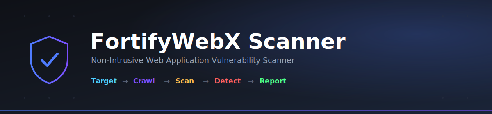
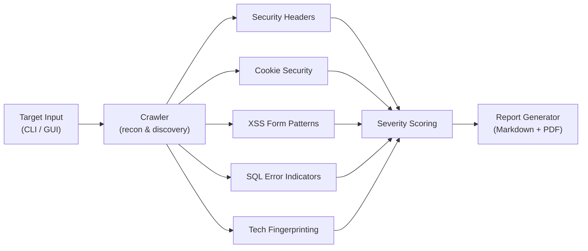
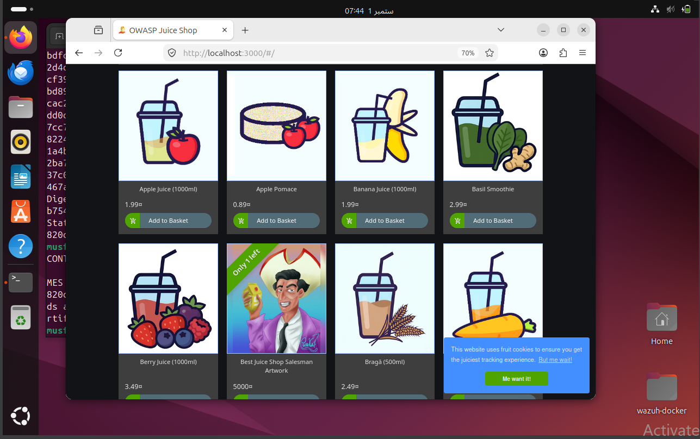
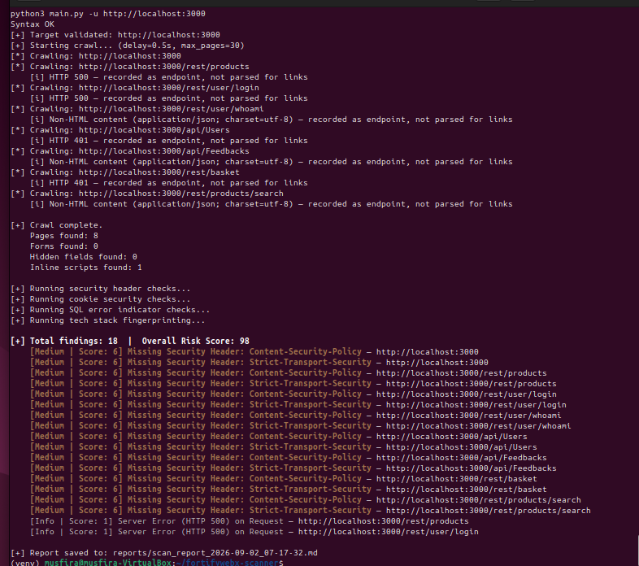
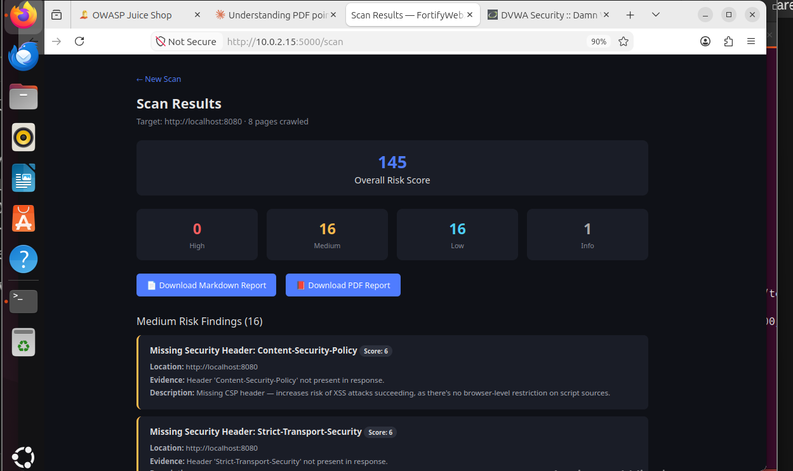
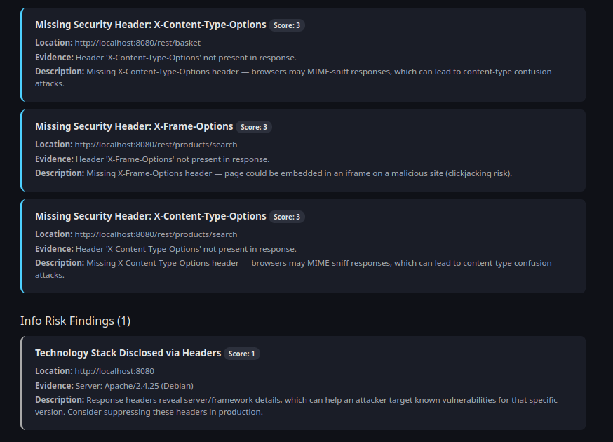

<p align="center">
  
</p>

<p align="center">
  
  
  
  
  
  
</p>

<p align="center">
A non-intrusive web application vulnerability scanner built from scratch — with recon crawling, five passive vulnerability checks, severity-scored reporting, a CLI, and a full web GUI.
</p>

<p align="center">
  <a href="#overview">Overview</a> •
  <a href="#features">Features</a> •
  <a href="#architecture">Architecture</a> •
  <a href="#screenshots">Screenshots</a> •
  <a href="#installation">Installation</a> •
  <a href="#usage">Usage</a> •
  <a href="#sample-findings--juice-shop-vs-dvwa">Sample Findings</a> •
  <a href="#known-limitations">Limitations</a>
</p>

---

## Overview

FortifyWebX Scanner takes a target URL, crawls it for pages/forms/endpoints, runs a set of **non-intrusive** vulnerability checks against everything it finds, and produces a scored, human-readable report (Markdown + PDF). It was built as the capstone project for the FortifyWebX cybersecurity internship, and is designed exclusively for scanning authorized, non-production lab targets — **OWASP Juice Shop** and **DVWA**.

No exploitation is ever attempted. Every check is passive: reading response headers, checking cookie flags, pattern-matching form structure, and inspecting response bodies for error text — never sending injection payloads.

## Features

| | |
|---|---|
| 🕷️ **Recon Crawler** | Breadth-first crawl with content-type/status-code awareness — won't misparse JSON or error pages as HTML |
| 🛡️ **5 Vulnerability Checks** | Security headers · cookie flags · XSS-risk form patterns · SQL error indicators · tech stack fingerprinting |
| 📊 **Severity Scoring** | Every finding gets a numeric score (9/6/3/1); an overall risk score summarizes the whole scan |
| 📄 **Dual Reports** | Clean Markdown and polished PDF, auto-generated per scan |
| 💻 **CLI** | Colored terminal output, configurable rate limiting and crawl depth |
| 🌐 **Web GUI** | Flask-based dashboard — enter a URL, get a live results page with downloadable reports |
| ✅ **Verified Checks** | Standalone test fixture proves check logic works correctly, independent of any single target's quirks |

## Architecture



## Screenshots

| Target Running | CLI — Colored Scan Output |
|---|---|
|  |  |

| Web GUI — Scan Results | Tech Stack Disclosure Finding |
|---|---|
|  |  |

More in [`docs/screenshots/`](docs/screenshots/), including the crawler's content-type handling and the XSS-check verification run.

## Installation

```bash
git clone <your-repo-url>
cd fortifywebx-scanner

python3 -m venv venv
source venv/bin/activate

pip install -r requirements.txt
```

Full setup (including test target setup) is in the **[User Guide](docs/USER_GUIDE.md)**.

## Usage

### CLI

```bash
python3 main.py -u http://localhost:3000
python3 main.py -u http://localhost:8080 --delay 1.0 --max-pages 15
```

### Web GUI

```bash
python3 app.py
```

Then open `http://localhost:5000`, enter a target, and view live results with downloadable reports.

## Sample Findings — Juice Shop vs. DVWA

Both targets were scanned at default settings. Full reports: [`docs/sample_report_juiceshop.md`](docs/sample_report_juiceshop.md).

| Check | Juice Shop | DVWA |
|---|---|---|
| Missing CSP / HSTS (Medium) | 16 | 16 |
| Missing X-Frame-Options / X-Content-Type-Options (Low) | 0 | 16 |
| Insecure cookies | 0 *(JWT-based auth, no cookies set)* | 0 *(pre-login pages only)* |
| Server errors / SQLi indicators (Info) | 2 | 0 |
| Tech stack disclosed (Info) | 0 *(headers suppressed)* | 1 *(`Apache/2.4.25`)* |
| **Overall Risk Score** | **98** | **145** |

The difference is real and explainable: Juice Shop suppresses more fingerprinting headers but leaks server errors; DVWA is missing more baseline security headers but doesn't disclose server errors. See the [User Guide](docs/USER_GUIDE.md#7-understanding-the-report) for how scoring works.

## Known Limitations

- **SPA form detection:** Juice Shop renders forms client-side (Angular), so a static crawler reports 0 forms there. The XSS/form-risk check logic is verified independently against a local HTML fixture (`tests/test_checks.py`) to prove it works correctly.
- **No authentication support:** the crawler doesn't log in, so authenticated-only areas (most of DVWA) aren't scanned.
- **Non-intrusive by design:** no payloads are ever sent — some vulnerability classes need manual, authorized follow-up beyond this tool's scope.

Full details in the [User Guide](docs/USER_GUIDE.md#8-known-limitations).

## Tech Stack

`Python 3` · `Requests` · `BeautifulSoup4` · `lxml` · `Flask` · `fpdf2` · `Colorama` · `Docker`

## Project Structure

```
fortifywebx-scanner/
├── main.py                  # CLI entry point
├── app.py                   # Flask web GUI
├── requirements.txt
├── modules/
│   ├── crawler.py           # Recon & discovery
│   ├── checks.py            # 5 vulnerability checks + severity scoring
│   └── report_generator.py  # Markdown + PDF report generation
├── templates/                # Web GUI HTML
├── tests/                     # Verification fixtures
├── docs/                       # User guide, sample report, screenshots
└── reports/                     # Generated output (gitignored)
```

## Ethics

This tool is built strictly for **authorized, non-production** scanning — OWASP Juice Shop, DVWA, or a designated lab target only. Never point it at a live or public site.

## License

[MIT](LICENSE)
